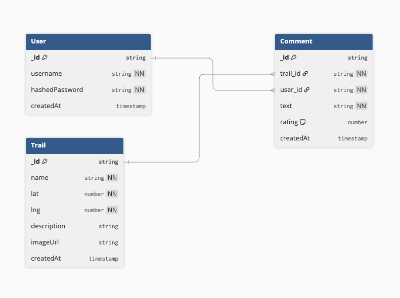
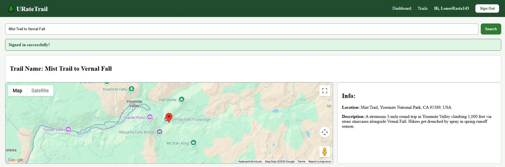

# URateTrail - Backend

Express + MongoDB API for **URateTrail**, a community web app where hikers can search for trails, view them on an interactive map, and leave star ratings and comments.

This repo is the backend (API). The frontend lives here: https://github.com/LonerRasta143/uratetrail-app-front-end

MERN stack group project for General Assembly Software Engineering Bootcamp Unit 3.

## Team

- William (frontend lead)
- Carlos (backend lead)

## Stack

- Node.js + Express 5
- MongoDB Atlas + Mongoose 9
- JWT auth (jsonwebtoken + bcrypt)
- CommonJS (`require` / `module.exports`)

## Data Model

Three entities: User, Trail, Comment. A User has many Comments, a Trail has many Comments, and the User-to-Trail relationship is derived through Comments (not a direct many-to-many).



## Status

Deployed and live.

- Backend (Heroku): https://uratetrail-app-back-end-7c6c4acd90d4.herokuapp.com
- Frontend (Netlify): <WILLIAM_NETLIFY_URL>

## Screenshots




## Getting started

### Prerequisites

- Node.js 20.x (pinned via `package.json` engines for Heroku)
- A MongoDB Atlas connection URI (ask Carlos for the team's shared URI)

### Setup

Clone the repo and install dependencies:

```
git clone https://github.com/lecharles/uratetrail-app-back-end.git
cd uratetrail-app-back-end
npm install
```

Create a `.env` file at the project root with these three variables:

```
MONGODB_URI=<the team's shared Atlas URI>
SECRET_KEY=<the team's shared JWT signing secret>
PORT=3000
```

Both `MONGODB_URI` and `SECRET_KEY` must match across team members so that data and JWTs are interchangeable. Ask Carlos directly for the values; they are not in any committed file.

Run the dev server:

```
npm run dev
```

You should see:

```
Connected to MongoDB uratetrail.
The express app is ready on port 3000!
```

### Seeding test data

The trails collection ships with 9 hand-picked Bay Area and Sierra trails. To populate (or repopulate) them:

```
node seed.js
```

This wipes the trails collection before inserting, so it is safe to rerun any time.

## API endpoints

### Public

- `POST /auth/sign-up` - create user, returns JWT
- `POST /auth/sign-in` - validate credentials, returns JWT

### Protected (requires `Authorization: Bearer <token>` header)

- `GET /trails` - list all trails, sorted newest first
- `GET /trails/:id` - one trail
- `POST /trails` - create
- `PUT /trails/:id` - update
- `DELETE /trails/:id` - delete
- `GET /comments` - all comments, with user and trail populated
- `GET /comments/trail/:trailId` - comments for one trail, with user populated
- `POST /comments` - create (user attached server-side from JWT, not request body)
- `PUT /comments/:id` - update (creator only, returns 403 otherwise)
- `DELETE /comments/:id` - delete (creator only, returns 403 otherwise)

All errors return JSON with shape `{ "err": "message" }`. Unknown routes return 404, resource not found returns 404, invalid token returns 401.

For copy-paste curl commands covering every endpoint plus error cases, see [`docs/API_TESTING.md`](docs/API_TESTING.md).

## Project documentation

- [`docs/REQUIREMENTS.md`](docs/REQUIREMENTS.md) - GA project requirements and rubric
- [`docs/TODO.md`](docs/TODO.md) - working task list
- [`docs/API_TESTING.md`](docs/API_TESTING.md) - curl commands for every endpoint
- [`docs/uratetrail-erd.png`](docs/uratetrail-erd.png) - data model diagram
